# 404 Found Us — Architecture

## System Overview

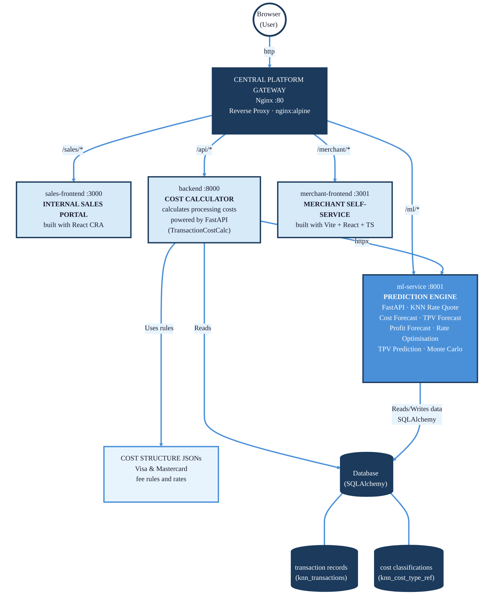

## Detailed Service Architecture

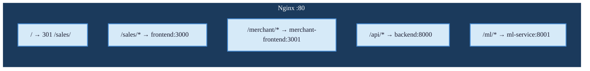

## Backend API Endpoints

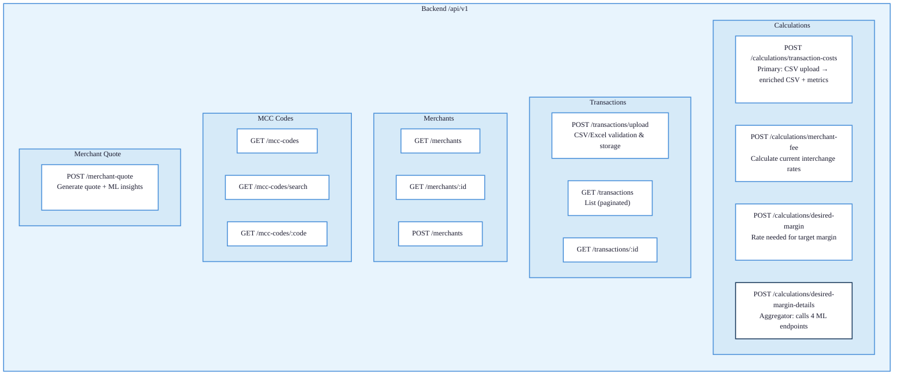

## ML Service Modules & Endpoints

```mermaid
%%{init: {'theme': 'base', 'themeVariables': { 'primaryColor': '#D6EAF8', 'primaryTextColor': '#1a1a2e', 'primaryBorderColor': '#4A90D9', 'lineColor': '#4A90D9', 'fontFamily': 'Segoe UI, sans-serif' }}}%%
graph TB
    subgraph ml["ML Service /ml"]
        direction TB

        ORCH["POST /ml/process<br/>Orchestrator: runs all 3 engines"]

        subgraph engines["Core Engines (called by /ml/process)"]
            RO["rate_optimisation/<br/>Rate Optimisation Engine"]
            TP["tpv_prediction/<br/>TPV Prediction Engine"]
            KNN["knn_rate_quote/<br/>KNN Rate Quote Engine"]
        end

        subgraph forecast["Forecast Services"]
            CF["cost_forecast/<br/>POST /ml/GetCostForecast<br/>M9 v2 monthly cost forecast"]
            VF["volume_forecast/<br/>POST /ml/GetVolumeForecast<br/>SARIMAX weekly volume"]
            PF["profit_forecast/<br/>POST /ml/GetProfitForecast<br/>Monte Carlo simulation"]
            TF["tpv_forecast/<br/>POST /ml/GetTPVForecast<br/>Conformal TPV forecast"]
        end

        subgraph knn_endpoints["KNN Endpoints"]
            GQ["POST /ml/getQuote"]
            GCM["POST /ml/getCompositeMerchant"]
        end

        subgraph health["Health"]
            HH["GET /ml/cost-forecast/health"]
        end

        ORCH --> RO
        ORCH --> TP
        ORCH --> KNN
    end

    subgraph artifacts["Trained Model Artifacts"]
        M9["artifacts/m9/<br/>└─ 5411/{1,3,6}/<br/>&nbsp;&nbsp;&nbsp;├─ models.pkl<br/>&nbsp;&nbsp;&nbsp;├─ scaler.pkl<br/>&nbsp;&nbsp;&nbsp;├─ cal_residuals.pkl<br/>&nbsp;&nbsp;&nbsp;├─ risk_models.pkl<br/>&nbsp;&nbsp;&nbsp;└─ config_snapshot.json"]
        TPV["artifacts/tpv/<br/>├─ 4121/<br/>├─ 5411/<br/>├─ 5499/<br/>└─ 5812/"]
    end

    CF -.->|loads| M9
    TF -.->|loads| TPV

    style ml fill:#E8F4FD,stroke:#4A90D9,stroke-width:2px,color:#1a1a2e
    style engines fill:#D6EAF8,stroke:#4A90D9,stroke-width:2px,color:#1a1a2e
    style forecast fill:#D6EAF8,stroke:#4A90D9,stroke-width:2px,color:#1a1a2e
    style knn_endpoints fill:#D6EAF8,stroke:#4A90D9,stroke-width:2px,color:#1a1a2e
    style health fill:#D6EAF8,stroke:#4A90D9,stroke-width:2px,color:#1a1a2e
    style artifacts fill:#1B3A5C,stroke:#1B3A5C,stroke-width:2px,color:#ffffff

    style ORCH fill:#4A90D9,stroke:#1B3A5C,stroke-width:2px,color:#ffffff
    style RO fill:#ffffff,stroke:#4A90D9,stroke-width:2px,color:#1a1a2e
    style TP fill:#ffffff,stroke:#4A90D9,stroke-width:2px,color:#1a1a2e
    style KNN fill:#ffffff,stroke:#4A90D9,stroke-width:2px,color:#1a1a2e
    style CF fill:#ffffff,stroke:#4A90D9,stroke-width:2px,color:#1a1a2e
    style VF fill:#ffffff,stroke:#4A90D9,stroke-width:2px,color:#1a1a2e
    style PF fill:#ffffff,stroke:#4A90D9,stroke-width:2px,color:#1a1a2e
    style TF fill:#ffffff,stroke:#4A90D9,stroke-width:2px,color:#1a1a2e
    style GQ fill:#ffffff,stroke:#4A90D9,stroke-width:2px,color:#1a1a2e
    style GCM fill:#ffffff,stroke:#4A90D9,stroke-width:2px,color:#1a1a2e
    style HH fill:#ffffff,stroke:#4A90D9,stroke-width:2px,color:#1a1a2e
    style M9 fill:#4A90D9,stroke:#1B3A5C,stroke-width:2px,color:#ffffff
    style TPV fill:#4A90D9,stroke:#1B3A5C,stroke-width:2px,color:#ffffff
```

## Primary Data Flow — Transaction Cost Calculation

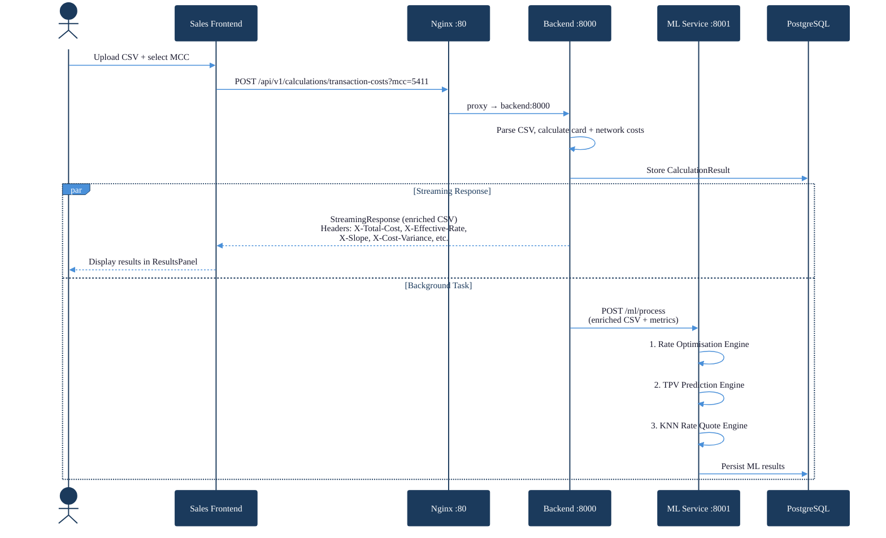

## Merchant Quotation Flow

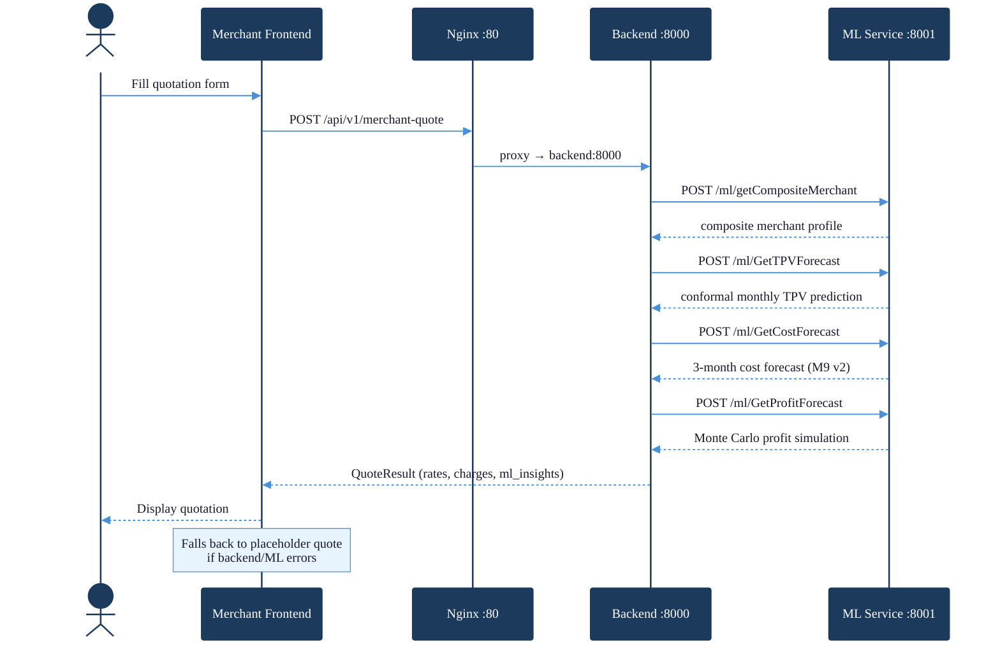

## Rates Quotation Tool — Data Flow

```mermaid
%%{init: {'theme': 'base', 'themeVariables': { 'primaryColor': '#D6EAF8', 'primaryTextColor': '#1a1a2e', 'primaryBorderColor': '#4A90D9', 'lineColor': '#4A90D9', 'fontFamily': 'Segoe UI, sans-serif' }, 'flowchart': { 'nodeSpacing': 20, 'rankSpacing': 30, 'padding': 10 }}}%%
flowchart TB
    U["User enters:<br/>MCC · Transactions CSV<br/>Desired Margin (bps) · [Current Rate] · [Fixed Fee]"]
    FE["DesiredMarginCalculator.jsx"]
    EP["POST /api/v1/calculations/desired-margin-details"]
    COST["Backend: Calculate interchange<br/>& network costs from transactions"]

    subgraph ML["ML Pipeline (4 sequential calls)"]
        direction TB
        KNN["① /ml/getCompositeMerchant<br/>KNN → 5 nearest merchants"]
        TPV["② /ml/GetTPVForecast<br/>Conformal monthly TPV prediction"]
        M9["③ /ml/GetCostForecast<br/>M9 v2 → 3-month cost %"]
        MC["④ /ml/GetProfitForecast<br/>Monte Carlo simulation<br/>(uses cost + TPV + fee rate + fixed fee)"]
        KNN --> TPV --> M9 --> MC
    end

    ASSEMBLE["Backend assembles:<br/>Recommended rate · Profitability curve<br/>Cost & volume forecasts · Estimated profit range"]
    RES["DesiredMarginResults.jsx<br/>Charts: Cost Forecast · Volume Trend · Probability Curve"]

    U --> FE --> EP --> COST --> ML --> ASSEMBLE --> RES

    style U fill:#ffffff,stroke:#1B3A5C,stroke-width:2px,color:#1a1a2e
    style FE fill:#D6EAF8,stroke:#1B3A5C,stroke-width:2px,color:#1a1a2e
    style EP fill:#1B3A5C,stroke:#1B3A5C,stroke-width:2px,color:#ffffff
    style COST fill:#D6EAF8,stroke:#4A90D9,stroke-width:2px,color:#1a1a2e
    style ML fill:#E8F4FD,stroke:#4A90D9,stroke-width:2px,color:#1a1a2e
    style KNN fill:#ffffff,stroke:#4A90D9,stroke-width:2px,color:#1a1a2e
    style TPV fill:#ffffff,stroke:#4A90D9,stroke-width:2px,color:#1a1a2e
    style M9 fill:#ffffff,stroke:#4A90D9,stroke-width:2px,color:#1a1a2e
    style MC fill:#4A90D9,stroke:#1B3A5C,stroke-width:2px,color:#ffffff
    style ASSEMBLE fill:#D6EAF8,stroke:#4A90D9,stroke-width:2px,color:#1a1a2e
    style RES fill:#D6EAF8,stroke:#1B3A5C,stroke-width:2px,color:#1a1a2e
```

## Profitability Calculator — Data Flow

```mermaid
%%{init: {'theme': 'base', 'themeVariables': { 'primaryColor': '#D6EAF8', 'primaryTextColor': '#1a1a2e', 'primaryBorderColor': '#4A90D9', 'lineColor': '#4A90D9', 'fontFamily': 'Segoe UI, sans-serif' }, 'flowchart': { 'nodeSpacing': 20, 'rankSpacing': 30, 'padding': 10 }}}%%
flowchart TB
    U["User enters:<br/>MCC · Transactions CSV<br/>[Current Rate] · [Fixed Fee]<br/>(desired margin hardcoded 1.5%)"]
    FE["EnhancedMerchantFeeCalculator.jsx"]
    EP["POST /api/v1/calculations/desired-margin-details"]
    COST["Backend: Calculate interchange<br/>& network costs from transactions"]

    subgraph ML["ML Pipeline (same 4 calls)"]
        direction TB
        KNN["① /ml/getCompositeMerchant<br/>KNN → 5 nearest merchants"]
        TPV["② /ml/GetTPVForecast<br/>Conformal monthly TPV prediction"]
        M9["③ /ml/GetCostForecast<br/>M9 v2 → 3-month cost %"]
        MC["④ /ml/GetProfitForecast<br/>Monte Carlo simulation<br/>(uses cost + TPV + fee rate + fixed fee)"]
        KNN --> TPV --> M9 --> MC
    end

    ASSEMBLE["Backend assembles:<br/>Cost & volume forecasts · Profitability curve<br/>Estimated profit range · Key metrics"]
    RES["ResultsPanel.jsx<br/>Charts: Cost Forecast · Volume Trend · Probability Curve<br/>+ Processing Volume · Fee Revenue"]

    U --> FE --> EP --> COST --> ML --> ASSEMBLE --> RES

    style U fill:#ffffff,stroke:#1B3A5C,stroke-width:2px,color:#1a1a2e
    style FE fill:#D6EAF8,stroke:#1B3A5C,stroke-width:2px,color:#1a1a2e
    style EP fill:#1B3A5C,stroke:#1B3A5C,stroke-width:2px,color:#ffffff
    style COST fill:#D6EAF8,stroke:#4A90D9,stroke-width:2px,color:#1a1a2e
    style ML fill:#E8F4FD,stroke:#4A90D9,stroke-width:2px,color:#1a1a2e
    style KNN fill:#ffffff,stroke:#4A90D9,stroke-width:2px,color:#1a1a2e
    style TPV fill:#ffffff,stroke:#4A90D9,stroke-width:2px,color:#1a1a2e
    style M9 fill:#ffffff,stroke:#4A90D9,stroke-width:2px,color:#1a1a2e
    style MC fill:#4A90D9,stroke:#1B3A5C,stroke-width:2px,color:#ffffff
    style ASSEMBLE fill:#D6EAF8,stroke:#4A90D9,stroke-width:2px,color:#1a1a2e
    style RES fill:#D6EAF8,stroke:#1B3A5C,stroke-width:2px,color:#1a1a2e
```

## Database Schema

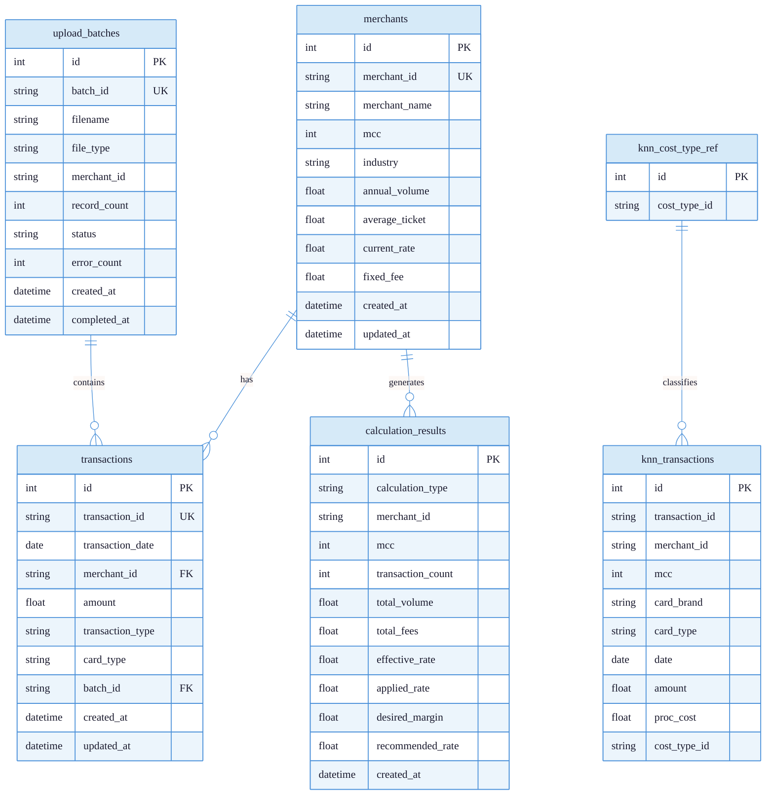

## Docker Compose Topology

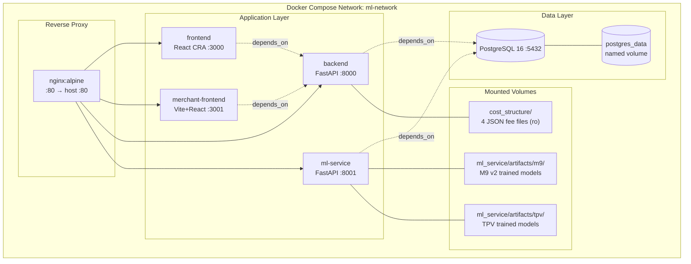

## Project Directory Structure (Live Code Only)

```
404_found_us/
├── docker-compose.yml          # Service orchestration
├── nginx/
│   └── default.conf            # Reverse proxy routing rules
├── backend/                    # FastAPI — fee calculations & data management
│   ├── app.py                  # Entry point, CORS, lifespan
│   ├── config.py               # ML_SERVICE_URL, DB config
│   ├── database.py             # SQLAlchemy engine + session
│   ├── models.py               # ORM: transactions, merchants, calculation_results, upload_batches
│   ├── routes.py               # All /api/v1 endpoints
│   ├── schemas.py              # Pydantic request/response models
│   ├── services.py             # DataProcessing, MerchantFeeCalculation, MCC services
│   ├── validators.py           # CSV/Excel row validation
│   ├── Dockerfile
│   └── modules/
│       ├── cost_calculation/   # Interchange cost computation
│       └── merchant_quote/     # Quote generation with ML pipeline
├── ml_service/                 # FastAPI — ML engine orchestration
│   ├── app.py                  # Entry point, initializes M9 + TPV caches
│   ├── config.py               # VECTOR_DIM, SARIMA params, artifact paths
│   ├── database.py             # SQLAlchemy engine + session
│   ├── models.py               # ORM: knn_transactions, knn_cost_type_ref
│   ├── routes.py               # All /ml endpoints
│   ├── schemas.py              # Shared Pydantic models
│   ├── Dockerfile
│   ├── artifacts/
│   │   ├── m9/5411/{1,3,6}/    # M9 v2 cost forecast models
│   │   └── tpv/{4121,5411,5499,5812}/  # TPV forecast models
│   └── modules/
│       ├── cost_forecast/      # M9 v2 artifact-based cost prediction
│       ├── tpv_forecast/       # Conformal TPV prediction
│       ├── knn_rate_quote/     # KNN-based rate quotation
│       ├── rate_optimisation/  # Rate optimisation engine
│       ├── tpv_prediction/     # TPV prediction engine
│       ├── profit_forecast/    # Monte Carlo profit simulation
│       └── volume_forecast/    # SARIMAX weekly volume forecast
├── frontend/                   # React CRA — Sales calculator UI
│   ├── src/
│   │   ├── App.js              # View router: landing, current-rates, desired-margin
│   │   ├── components/
│   │   │   ├── LandingPage.jsx
│   │   │   ├── EnhancedMerchantFeeCalculator.jsx
│   │   │   ├── DesiredMarginCalculator.jsx
│   │   │   ├── ResultsPanel.jsx
│   │   │   ├── DataUploadValidator.jsx
│   │   │   ├── ManualTransactionEntry.jsx
│   │   │   └── MCCDropdown.jsx
│   │   ├── services/api.js     # Axios API client
│   │   ├── hooks/              # useFileValidation, useTransactionValidation
│   │   └── lib/ui/             # Shared UI primitives
│   └── Dockerfile
├── merchant-frontend/          # Vite + React + TypeScript — Merchant quotation UI
│   ├── src/
│   │   ├── App.tsx             # Form → Result state machine
│   │   └── components/
│   │       ├── QuotationForm.tsx
│   │       └── QuotationResult.tsx
│   └── Dockerfile
├── cost_structure/             # Payment card network fee JSON files (mounted ro)
│   ├── visa_Card.JSON
│   ├── visa_Network.JSON
│   ├── masterCard_Card.JSON
│   └── masterCard_Network.JSON
├── data/                       # Sample/test CSV datasets
└── archive/                    # Archived dead/legacy code
    ├── backend/errors.py
    ├── ml_service/
    │   ├── modules/{cluster_assignment, cluster_generation, m9_forecast}/
    │   ├── modules/cost_forecast/*_sarima_legacy.py
    │   └── migrate_sqlite_to_postgres.py
    ├── ml_pipeline/            # Training notebooks, EDA, Matt_EDA services
    ├── KNN Demo Service/       # Legacy KNN training data + SQLite DB
    ├── tools/                  # Standalone dev utilities
    └── scripts/                # One-time setup & git workflow PS1 scripts
```

## Technology Stack

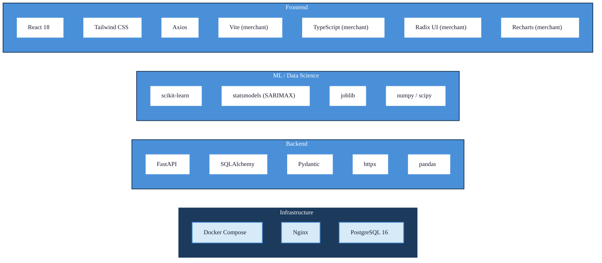
